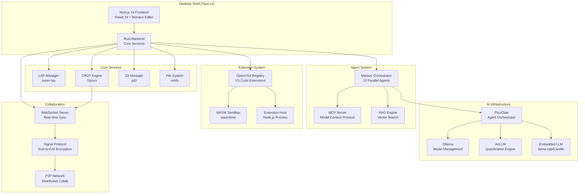
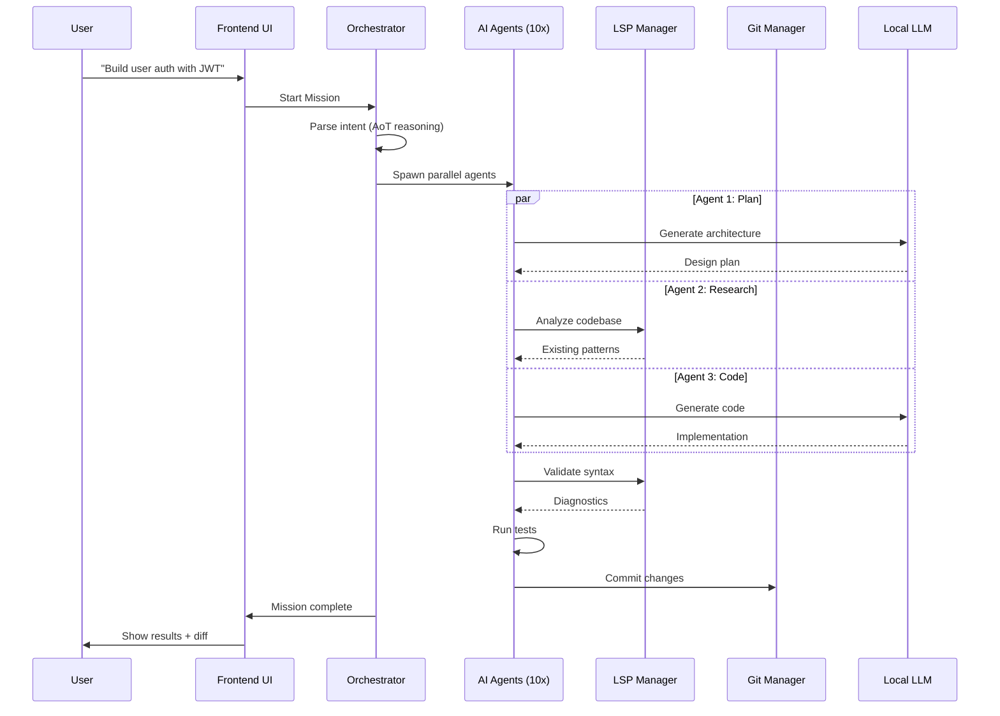

# Design Document: Kyro IDE Complete System

## Overview

Kyro IDE is a next-generation, AI-native code editor designed to compete with VS Code, Cursor, and Antigravity in 2026. The core differentiator is **local-first AI** with zero cloud dependencies, using embedded LLM models (Ollama, AirLLM) orchestrated by autonomous agents (PicoClaw) for unlimited, cost-free intelligent coding assistance. Built on Tauri v2 (Rust backend) and Next.js 16 (React 19 frontend), Kyro targets extreme lightweight operation (<100MB RAM idle) while supporting 165+ programming languages, real-time collaboration for 50+ users, and a VS Code-compatible extension ecosystem via OpenVSX.

The architecture follows a **"AI that happens to have an IDE attached"** philosophy, where AI agents are first-class citizens with permission-based trust layers, hierarchical memory for codebase understanding, and Atoms-of-Thought reasoning to minimize GPU load. The system is cross-platform (Windows, macOS, Linux), privacy-first (E2E encryption via Signal Protocol), and designed for single-prompt workflows: describe a feature, get tested and deployed code in 30 seconds.

## Architecture

### System Architecture Overview



### Technology Stack

| Layer | Technology | Purpose |
|-------|------------|---------|
| **Desktop Shell** | Tauri v2 | Cross-platform native wrapper (Rust + WebView) |
| **Frontend** | Next.js 16, React 19 | UI framework with SSR/SSG support |
| **Editor** | Monaco Editor | VS Code's editor component |
| **UI Components** | shadcn/ui, Radix UI, Tailwind CSS | Modern component library |
| **Backend** | Rust (tokio async runtime) | High-performance native services |
| **AI Models** | Ollama, llama.cpp, Candle | Local LLM inference engines |
| **Quantization** | AirLLM (Python bridge) | Run 70B models on 4-8GB VRAM |
| **Agent Framework** | PicoClaw | Ultra-lightweight agent orchestration |
| **LSP** | tower-lsp, tree-sitter | Language intelligence (165+ languages) |
| **CRDT** | Yjs (yrs Rust port), Loro | Conflict-free collaborative editing |
| **Git** | git2 (libgit2 bindings) | Version control integration |
| **Extensions** | OpenVSX, wasmtime | VS Code-compatible extension system |
| **Database** | rusqlite (SQLite) | Agent memory and metadata |
| **Vector DB** | Custom (ndarray + bincode) | RAG embeddings storage |
| **Encryption** | Signal Protocol (x25519, ChaCha20-Poly1305) | E2E encrypted collaboration |
| **Updates** | tauri-plugin-updater | Auto-update mechanism |


## Main Workflow: Single-Prompt Development



## Components and Interfaces

### 1. Desktop Shell (Tauri)

**Purpose**: Cross-platform native application wrapper with minimal overhead

**Interface**:
```rust
// src-tauri/src/main.rs
pub struct KyroApp {
    window: WebviewWindow,
    services: Arc<ServiceRegistry>,
}

impl KyroApp {
    pub fn new() -> Result<Self>;
    pub fn run(self) -> Result<()>;
    pub fn setup(&mut self, app: &mut App) -> Result<()>;
}

pub struct ServiceRegistry {
    terminal: Arc<Mutex<TerminalManager>>,
    ai: Arc<Mutex<AiClient>>,
    lsp: Arc<RwLock<MolecularLsp>>,
    git: Arc<Mutex<GitManager>>,
    collab: Arc<Mutex<CollaborationManager>>,
    orchestrator: Arc<RwLock<KyroOrchestrator>>,
}
```

**Responsibilities**:
- Initialize Tauri window and WebView
- Register all Tauri commands (IPC bridge)
- Manage service lifecycle
- Handle OS-level events (file associations, deep links)
- Auto-update management


### 2. Frontend UI (Next.js + React)

**Purpose**: Modern web-based UI with Monaco editor integration

**Interface**:
```typescript
// src/app/page.tsx
export default function EditorPage() {
  return <EditorLayout />;
}

// src/components/editor/EditorLayout.tsx
interface EditorLayoutProps {
  initialFiles?: FileNode[];
  theme?: 'light' | 'dark';
}

export function EditorLayout(props: EditorLayoutProps): JSX.Element;

// src/components/editor/MonacoEditor.tsx
interface MonacoEditorProps {
  value: string;
  language: string;
  onChange: (value: string) => void;
  onSave: () => void;
}

export function MonacoEditor(props: MonacoEditorProps): JSX.Element;

// src/lib/tauri-commands.ts
export async function readFile(path: string): Promise<string>;
export async function writeFile(path: string, content: string): Promise<void>;
export async function chatCompletion(messages: Message[]): Promise<string>;
export async function startMission(prompt: string): Promise<MissionId>;
```

**Responsibilities**:
- Render Monaco editor with syntax highlighting
- File tree navigation (sidebar)
- Terminal panel integration
- AI chat sidebar
- Command palette (Cmd+K)
- Extension marketplace UI
- Collaboration presence indicators

### 3. AI Orchestrator (Mission Control)

**Purpose**: Coordinate 10 parallel AI agents for autonomous development tasks

**Interface**:
```rust
// src-tauri/src/orchestrator/mod.rs
pub struct KyroOrchestrator {
    config: OrchestratorConfig,
    missions: DashMap<MissionId, Mission>,
    agent_pool: AgentPool,
    llm_router: LLMRouter,
}

impl KyroOrchestrator {
    pub fn new(config: OrchestratorConfig) -> Self;
    
    pub async fn start_mission(&self, prompt: String) -> Result<MissionId>;
    pub async fn get_mission(&self, id: MissionId) -> Option<Mission>;
    pub async fn cancel_mission(&self, id: MissionId) -> Result<()>;
    
    async fn parse_intent(&self, prompt: &str) -> Intent;
    async fn spawn_agents(&self, intent: Intent) -> Vec<AgentHandle>;
    async fn coordinate_agents(&self, agents: Vec<AgentHandle>) -> Result<MissionResult>;
}

pub struct Mission {
    pub id: MissionId,
    pub prompt: String,
    pub status: MissionStatus,
    pub phases: Vec<MissionPhase>,
    pub created_at: DateTime<Utc>,
    pub completed_at: Option<DateTime<Utc>>,
}

pub enum MissionStatus {
    Planning,
    Executing,
    Testing,
    Reviewing,
    Completed,
    Failed(String),
}

pub enum MissionPhase {
    Plan { agent_id: AgentId, output: String },
    Research { agent_id: AgentId, findings: Vec<CodeReference> },
    Code { agent_id: AgentId, files: Vec<FileChange> },
    Test { agent_id: AgentId, results: TestResults },
    Review { agent_id: AgentId, feedback: String },
    Deploy { agent_id: AgentId, commit_hash: String },
}
```

**Responsibilities**:
- Parse user intent using Atoms-of-Thought reasoning
- Spawn specialized agents (planner, researcher, coder, tester, reviewer)
- Route tasks to appropriate LLM (Ollama, AirLLM, embedded)
- Aggregate agent outputs
- Handle failures and retries
- Provide real-time progress updates


### 4. Local LLM Infrastructure

**Purpose**: Zero-cost AI inference using local models with intelligent quantization

**Interface**:
```rust
// src-tauri/src/embedded_llm/mod.rs
pub struct EmbeddedLLMEngine {
    config: EmbeddedLLMConfig,
    loaded_models: DashMap<String, LoadedModel>,
    hardware: HardwareCapabilities,
}

impl EmbeddedLLMEngine {
    pub async fn new(config: EmbeddedLLMConfig) -> Result<Self>;
    
    pub async fn load_model(&self, model_name: &str) -> Result<()>;
    pub async fn unload_model(&self, model_name: &str) -> Result<()>;
    pub async fn generate(&self, prompt: &str, options: GenerateOptions) -> Result<String>;
    pub async fn stream_generate(&self, prompt: &str) -> Result<impl Stream<Item = String>>;
}

pub struct HardwareCapabilities {
    pub vram_bytes: u64,
    pub ram_bytes: u64,
    pub gpu_name: Option<String>,
    pub recommended_backend: String, // "cuda", "metal", "vulkan", "cpu"
    pub recommended_tier: MemoryTier,
    pub cpu_cores: usize,
    pub cpu_features: Vec<String>, // "avx2", "avx512", "neon"
}

pub enum MemoryTier {
    Cpu,           // CPU-only, 4GB RAM
    Low4GB,        // 4GB VRAM: phi-2b, qwen-2.5b
    Medium8GB,     // 8GB VRAM: llama-7b-q4, mistral-7b-q4
    High16GB,      // 16GB VRAM: llama-13b-q4, mixtral-8x7b-q4
    Ultra24GB,     // 24GB+ VRAM: llama-70b-q4 (via AirLLM)
}

// src-tauri/src/airllm/mod.rs
pub struct AirLLMBridge {
    python_process: Child,
    ipc_channel: IpcChannel,
}

impl AirLLMBridge {
    pub async fn new() -> Result<Self>;
    
    pub async fn load_model(&self, model_path: &str, compression: CompressionLevel) -> Result<()>;
    pub async fn generate(&self, prompt: &str) -> Result<String>;
    pub fn get_memory_usage(&self) -> MemoryStats;
}

pub enum CompressionLevel {
    Q4_K_M,  // 4-bit quantization (default)
    Q5_K_M,  // 5-bit quantization
    Q8_0,    // 8-bit quantization
}

// src-tauri/src/picoclaw/mod.rs
pub struct PicoClawEngine {
    config: PicoClawConfig,
    model: Option<PicoClawModel>,
}

impl PicoClawEngine {
    pub fn new(config: PicoClawConfig) -> Self;
    
    pub async fn complete(&self, prompt: &str, max_tokens: usize) -> Result<String>;
    pub async fn analyze(&self, code: &str) -> Result<CodeAnalysis>;
    pub fn memory_usage(&self) -> usize; // Returns bytes
}
```

**Responsibilities**:
- Detect hardware capabilities (GPU, VRAM, CPU features)
- Auto-select appropriate model tier
- Manage model loading/unloading
- Route requests to Ollama, embedded llama.cpp, or AirLLM
- Handle quantization for memory efficiency
- Provide streaming inference
- Monitor GPU/CPU usage


### 5. LSP Manager (Language Intelligence)

**Purpose**: Provide IDE features for 165+ languages via Language Server Protocol

**Interface**:
```rust
// src-tauri/src/lsp/mod.rs
pub struct MolecularLsp {
    servers: DashMap<String, LspServer>,
    tree_sitter_parsers: DashMap<String, Parser>,
}

impl MolecularLsp {
    pub fn new() -> Self;
    
    pub async fn start_server(&self, language: &str, root_uri: Url) -> Result<()>;
    pub async fn stop_server(&self, language: &str) -> Result<()>;
    
    pub async fn get_completions(&self, params: CompletionParams) -> Result<Vec<CompletionItem>>;
    pub async fn get_hover(&self, params: HoverParams) -> Result<Option<Hover>>;
    pub async fn goto_definition(&self, params: GotoDefinitionParams) -> Result<Vec<Location>>;
    pub async fn get_diagnostics(&self, uri: &Url) -> Result<Vec<Diagnostic>>;
    pub async fn format_document(&self, uri: &Url) -> Result<Vec<TextEdit>>;
    
    pub fn detect_language(&self, file_path: &str) -> Option<String>;
    pub fn extract_symbols(&self, code: &str, language: &str) -> Result<Vec<Symbol>>;
}

pub struct LspServer {
    language: String,
    process: Child,
    client: tower_lsp::Client,
    capabilities: ServerCapabilities,
}

// src-tauri/src/lsp/completion_engine.rs
pub struct AiCompletionEngine {
    lsp: Arc<RwLock<MolecularLsp>>,
    cache: DashMap<String, Vec<CompletionItem>>,
}

impl AiCompletionEngine {
    pub fn new(lsp: Arc<RwLock<MolecularLsp>>) -> Self;
    
    pub async fn get_ai_completions(
        &self,
        context: CompletionContext,
        llm: &dyn LLMProvider,
    ) -> Result<Vec<CompletionItem>>;
    
    async fn build_context(&self, params: &CompletionParams) -> CompletionContext;
    async fn rank_completions(&self, items: Vec<CompletionItem>) -> Vec<CompletionItem>;
}

pub struct CompletionContext {
    pub file_content: String,
    pub cursor_position: Position,
    pub surrounding_code: String,
    pub imports: Vec<String>,
    pub symbols: Vec<Symbol>,
}
```

**Responsibilities**:
- Spawn and manage LSP server processes (rust-analyzer, typescript-language-server, etc.)
- Handle LSP protocol communication (JSON-RPC over stdio)
- Parse code using tree-sitter for 165+ languages
- Provide completions, hover info, diagnostics, formatting
- Integrate AI-powered completions
- Cache results for performance
- Handle server crashes and restarts


### 6. CRDT Collaboration Engine

**Purpose**: Real-time collaborative editing for 50+ users with conflict-free merging

**Interface**:
```rust
// src-tauri/src/collab/mod.rs
pub struct CollaborationManager {
    config: CollaborationConfig,
    rooms: DashMap<RoomId, Room>,
    ws_client: Option<WebSocketClient>,
}

impl CollaborationManager {
    pub fn new(config: CollaborationConfig) -> Self;
    
    pub async fn create_room(&self, name: String) -> Result<RoomId>;
    pub async fn join_room(&self, room_id: RoomId, user: User) -> Result<()>;
    pub async fn leave_room(&self, room_id: RoomId) -> Result<()>;
    
    pub async fn send_operation(&self, room_id: RoomId, op: Operation) -> Result<()>;
    pub async fn apply_remote_operation(&self, room_id: RoomId, op: Operation) -> Result<()>;
    
    pub async fn get_presence(&self, room_id: RoomId) -> Vec<UserPresence>;
    pub async fn update_presence(&self, room_id: RoomId, presence: UserPresence) -> Result<()>;
}

pub struct Room {
    pub id: RoomId,
    pub name: String,
    pub doc: YDoc,
    pub users: DashMap<UserId, UserPresence>,
    pub created_at: DateTime<Utc>,
}

pub struct YDoc {
    doc: yrs::Doc,
    text: yrs::TextRef,
}

impl YDoc {
    pub fn new() -> Self;
    
    pub fn apply_update(&mut self, update: &[u8]) -> Result<()>;
    pub fn get_state_vector(&self) -> Vec<u8>;
    pub fn get_update(&self, state_vector: &[u8]) -> Vec<u8>;
    
    pub fn insert(&mut self, index: u32, content: &str);
    pub fn delete(&mut self, index: u32, length: u32);
    pub fn to_string(&self) -> String;
}

pub struct UserPresence {
    pub user_id: UserId,
    pub username: String,
    pub cursor_position: Option<Position>,
    pub selection_range: Option<Range>,
    pub color: String,
    pub last_seen: DateTime<Utc>,
}

// src-tauri/src/e2ee/mod.rs
pub struct SignalProtocol {
    identity_key: IdentityKeyPair,
    sessions: DashMap<UserId, Session>,
}

impl SignalProtocol {
    pub fn new() -> Result<Self>;
    
    pub fn get_public_key(&self) -> PublicKey;
    pub fn create_key_bundle(&self) -> KeyBundle;
    
    pub async fn init_session(&mut self, peer_id: UserId, bundle: KeyBundle) -> Result<()>;
    pub async fn encrypt(&self, peer_id: UserId, plaintext: &[u8]) -> Result<Vec<u8>>;
    pub async fn decrypt(&self, peer_id: UserId, ciphertext: &[u8]) -> Result<Vec<u8>>;
}
```

**Responsibilities**:
- Manage CRDT documents (Yjs/yrs)
- Synchronize operations via WebSocket
- Handle user presence (cursors, selections)
- Encrypt/decrypt messages using Signal Protocol
- Resolve conflicts automatically
- Persist state to Git
- Support P2P mode (optional)


### 7. Extension System (OpenVSX)

**Purpose**: VS Code-compatible extension marketplace and runtime

**Interface**:
```rust
// src-tauri/src/vscode_compat/mod.rs
pub struct ExtensionManager {
    registry: OpenVSXRegistry,
    installed: DashMap<ExtensionId, Extension>,
    extension_host: Option<ExtensionHost>,
}

impl ExtensionManager {
    pub fn new() -> Self;
    
    pub async fn search_extensions(&self, query: &str) -> Result<Vec<ExtensionMetadata>>;
    pub async fn install_extension(&self, id: &str) -> Result<()>;
    pub async fn uninstall_extension(&self, id: &str) -> Result<()>;
    pub async fn enable_extension(&self, id: &str) -> Result<()>;
    pub async fn disable_extension(&self, id: &str) -> Result<()>;
    
    pub fn list_installed(&self) -> Vec<Extension>;
    pub async fn reload_extensions(&self) -> Result<()>;
}

pub struct OpenVSXRegistry {
    base_url: String,
    client: reqwest::Client,
}

impl OpenVSXRegistry {
    pub async fn search(&self, query: &str) -> Result<Vec<ExtensionMetadata>>;
    pub async fn get_details(&self, id: &str) -> Result<ExtensionDetails>;
    pub async fn download(&self, id: &str, version: &str) -> Result<Vec<u8>>;
}

pub struct Extension {
    pub id: ExtensionId,
    pub name: String,
    pub version: String,
    pub publisher: String,
    pub description: String,
    pub enabled: bool,
    pub activation_events: Vec<String>,
    pub contributes: ExtensionContributions,
}

pub struct ExtensionContributions {
    pub commands: Vec<Command>,
    pub languages: Vec<LanguageContribution>,
    pub grammars: Vec<GrammarContribution>,
    pub themes: Vec<ThemeContribution>,
}

// src-tauri/src/plugin_sandbox/mod.rs
pub struct PluginManager {
    plugins_dir: PathBuf,
    loaded_plugins: DashMap<String, WasmPlugin>,
    runtime: wasmtime::Engine,
}

impl PluginManager {
    pub fn new(plugins_dir: PathBuf) -> Self;
    
    pub async fn load_plugin(&self, path: &Path) -> Result<()>;
    pub async fn unload_plugin(&self, id: &str) -> Result<()>;
    pub async fn execute_function(&self, id: &str, func: &str, args: Vec<Value>) -> Result<Value>;
    
    pub fn get_capabilities(&self, id: &str) -> Option<Vec<Capability>>;
}

pub struct WasmPlugin {
    id: String,
    module: wasmtime::Module,
    instance: wasmtime::Instance,
    capabilities: Vec<Capability>,
}

pub enum Capability {
    FileSystem(FileSystemAccess),
    Network(NetworkAccess),
    Process(ProcessAccess),
}
```

**Responsibilities**:
- Search and download extensions from OpenVSX
- Parse extension manifests (package.json)
- Install/uninstall extensions
- Spawn Node.js extension host process
- Implement VS Code API surface (vscode.commands, vscode.window, etc.)
- Sandbox WASM plugins with capability-based security
- Handle extension activation events
- Provide extension marketplace UI


### 8. Git Integration

**Purpose**: Version control operations and Git-backed CRDT persistence

**Interface**:
```rust
// src-tauri/src/git/mod.rs
pub struct GitManager {
    repos: DashMap<PathBuf, Repository>,
}

impl GitManager {
    pub fn new() -> Self;
    
    pub fn open_repo(&self, path: &Path) -> Result<()>;
    pub fn get_status(&self, path: &Path) -> Result<Vec<StatusEntry>>;
    pub fn stage_file(&self, path: &Path, file: &Path) -> Result<()>;
    pub fn commit(&self, path: &Path, message: &str) -> Result<Oid>;
    pub fn get_diff(&self, path: &Path) -> Result<String>;
    pub fn get_log(&self, path: &Path, limit: usize) -> Result<Vec<Commit>>;
    pub fn create_branch(&self, path: &Path, name: &str) -> Result<()>;
    pub fn switch_branch(&self, path: &Path, name: &str) -> Result<()>;
}

// src-tauri/src/git_crdt/mod.rs
pub struct GitCRDTManager {
    git: Arc<Mutex<GitManager>>,
    crdt: Arc<Mutex<CollaborationManager>>,
    auto_commit_interval: Duration,
}

impl GitCRDTManager {
    pub fn new(git: Arc<Mutex<GitManager>>, crdt: Arc<Mutex<CollaborationManager>>) -> Self;
    
    pub async fn sync(&self, repo_path: &Path) -> Result<()>;
    pub async fn auto_commit(&self, repo_path: &Path) -> Result<()>;
    pub async fn resolve_conflict(&self, repo_path: &Path, file: &Path) -> Result<()>;
    
    async fn persist_crdt_state(&self, repo_path: &Path) -> Result<()>;
    async fn load_crdt_state(&self, repo_path: &Path) -> Result<()>;
}
```

**Responsibilities**:
- Open and manage Git repositories
- Provide status, diff, log operations
- Stage and commit changes
- Branch management
- Persist CRDT state to Git commits
- Auto-commit on intervals
- Resolve merge conflicts using CRDT


### 9. Terminal Manager

**Purpose**: Integrated terminal with PTY support

**Interface**:
```rust
// src-tauri/src/terminal/mod.rs
pub struct TerminalManager {
    terminals: DashMap<TerminalId, Terminal>,
}

impl TerminalManager {
    pub fn new() -> Self;
    
    pub fn create_terminal(&self, cwd: Option<PathBuf>) -> Result<TerminalId>;
    pub fn write(&self, id: TerminalId, data: &str) -> Result<()>;
    pub fn resize(&self, id: TerminalId, cols: u16, rows: u16) -> Result<()>;
    pub fn kill(&self, id: TerminalId) -> Result<()>;
}

pub struct Terminal {
    id: TerminalId,
    pty: Box<dyn portable_pty::MasterPty>,
    process: Box<dyn portable_pty::Child>,
}
```

**Responsibilities**:
- Create pseudo-terminal (PTY) instances
- Handle terminal I/O
- Resize terminal on window changes
- Kill terminal processes
- Support multiple concurrent terminals

### 10. File System Manager

**Purpose**: File operations with watching and tree generation

**Interface**:
```rust
// src-tauri/src/files/mod.rs
pub struct FileWatcher {
    watcher: notify::RecommendedWatcher,
    window: WebviewWindow,
}

impl FileWatcher {
    pub fn new(window: WebviewWindow) -> Self;
    
    pub fn watch(&mut self, path: &Path) -> Result<()>;
    pub fn unwatch(&mut self, path: &Path) -> Result<()>;
}

pub async fn read_file(path: &str) -> Result<String>;
pub async fn write_file(path: &str, content: &str) -> Result<()>;
pub async fn list_directory(path: &str) -> Result<Vec<DirEntry>>;
pub async fn get_file_tree(path: &str) -> Result<FileNode>;

pub struct FileNode {
    pub name: String,
    pub path: String,
    pub is_directory: bool,
    pub children: Option<Vec<FileNode>>,
}
```

**Responsibilities**:
- Read/write files
- List directories
- Generate file tree
- Watch for file changes
- Emit events to frontend


## Data Models

### User and Authentication

```typescript
// Frontend types
interface User {
  id: string;
  username: string;
  email: string;
  role: 'user' | 'admin';
  created_at: Date;
}

interface Session {
  token: string;
  user: User;
  expires_at: Date;
}

interface OAuthProvider {
  name: 'github' | 'google' | 'gitlab';
  client_id: string;
  redirect_uri: string;
}
```

```rust
// Backend types
pub struct User {
    pub id: Uuid,
    pub username: String,
    pub email: String,
    pub password_hash: String,
    pub role: UserRole,
    pub created_at: DateTime<Utc>,
}

pub enum UserRole {
    User,
    Admin,
}

pub struct Session {
    pub token: String,
    pub user_id: Uuid,
    pub expires_at: DateTime<Utc>,
}
```

**Validation Rules**:
- Username: 3-32 characters, alphanumeric + underscore
- Email: Valid email format
- Password: Minimum 8 characters, hashed with Argon2
- Token: JWT with 24-hour expiration

### File System

```typescript
interface FileNode {
  name: string;
  path: string;
  is_directory: boolean;
  size?: number;
  modified_at?: Date;
  children?: FileNode[];
}

interface FileChange {
  path: string;
  type: 'create' | 'modify' | 'delete';
  content?: string;
}
```

```rust
pub struct FileNode {
    pub name: String,
    pub path: PathBuf,
    pub is_directory: bool,
    pub size: Option<u64>,
    pub modified_at: Option<SystemTime>,
    pub children: Option<Vec<FileNode>>,
}

pub enum FileChangeType {
    Create,
    Modify,
    Delete,
}

pub struct FileChange {
    pub path: PathBuf,
    pub change_type: FileChangeType,
    pub content: Option<String>,
}
```

**Validation Rules**:
- Path: Must be within workspace root (security)
- Name: No null bytes, valid UTF-8
- Size: Maximum 100MB per file (configurable)


### AI and Agents

```typescript
interface Message {
  role: 'user' | 'assistant' | 'system';
  content: string;
  timestamp: Date;
}

interface CompletionRequest {
  prompt: string;
  max_tokens: number;
  temperature: number;
  stop_sequences?: string[];
}

interface Mission {
  id: string;
  prompt: string;
  status: 'planning' | 'executing' | 'testing' | 'reviewing' | 'completed' | 'failed';
  phases: MissionPhase[];
  created_at: Date;
  completed_at?: Date;
}

interface MissionPhase {
  type: 'plan' | 'research' | 'code' | 'test' | 'review' | 'deploy';
  agent_id: string;
  status: 'pending' | 'running' | 'completed' | 'failed';
  output?: any;
}
```

```rust
pub struct Message {
    pub role: MessageRole,
    pub content: String,
    pub timestamp: DateTime<Utc>,
}

pub enum MessageRole {
    User,
    Assistant,
    System,
}

pub struct CompletionRequest {
    pub prompt: String,
    pub max_tokens: usize,
    pub temperature: f32,
    pub stop_sequences: Vec<String>,
}

pub struct Agent {
    pub id: AgentId,
    pub name: String,
    pub role: AgentRole,
    pub status: AgentStatus,
    pub memory: AgentMemory,
}

pub enum AgentRole {
    Planner,
    Researcher,
    Coder,
    Tester,
    Reviewer,
    Deployer,
}

pub enum AgentStatus {
    Idle,
    Working,
    Waiting,
    Failed(String),
}

pub struct AgentMemory {
    pub short_term: Vec<Message>,
    pub long_term: Vec<MemoryEntry>,
    pub context_window: usize,
}

pub struct MemoryEntry {
    pub id: Uuid,
    pub content: String,
    pub embedding: Option<Vec<f32>>,
    pub timestamp: DateTime<Utc>,
}
```

**Validation Rules**:
- Prompt: Maximum 32K tokens (context window)
- Temperature: 0.0 to 2.0
- Max tokens: 1 to 4096
- Agent memory: Maximum 100 entries in short-term


### Collaboration

```typescript
interface Room {
  id: string;
  name: string;
  users: UserPresence[];
  created_at: Date;
}

interface UserPresence {
  user_id: string;
  username: string;
  cursor_position?: { line: number; column: number };
  selection_range?: { start: Position; end: Position };
  color: string;
  last_seen: Date;
}

interface Operation {
  type: 'insert' | 'delete';
  position: number;
  content?: string;
  length?: number;
  user_id: string;
  timestamp: Date;
}

interface Position {
  line: number;
  column: number;
}
```

```rust
pub struct Room {
    pub id: RoomId,
    pub name: String,
    pub doc: YDoc,
    pub users: DashMap<UserId, UserPresence>,
    pub created_at: DateTime<Utc>,
}

pub struct UserPresence {
    pub user_id: UserId,
    pub username: String,
    pub cursor_position: Option<Position>,
    pub selection_range: Option<Range>,
    pub color: String,
    pub last_seen: DateTime<Utc>,
}

pub enum Operation {
    Insert { position: u32, content: String },
    Delete { position: u32, length: u32 },
}

pub struct Position {
    pub line: u32,
    pub column: u32,
}

pub struct Range {
    pub start: Position,
    pub end: Position,
}
```

**Validation Rules**:
- Room name: 1-64 characters
- Maximum 50 users per room
- Operation position: Must be within document bounds
- Presence updates: Maximum 10 per second per user

### Extensions

```typescript
interface Extension {
  id: string;
  name: string;
  version: string;
  publisher: string;
  description: string;
  enabled: boolean;
  activation_events: string[];
  contributes: ExtensionContributions;
}

interface ExtensionContributions {
  commands?: Command[];
  languages?: LanguageContribution[];
  grammars?: GrammarContribution[];
  themes?: ThemeContribution[];
}

interface Command {
  command: string;
  title: string;
  category?: string;
}
```

```rust
pub struct Extension {
    pub id: ExtensionId,
    pub name: String,
    pub version: String,
    pub publisher: String,
    pub description: String,
    pub enabled: bool,
    pub activation_events: Vec<String>,
    pub contributes: ExtensionContributions,
}

pub struct ExtensionContributions {
    pub commands: Vec<Command>,
    pub languages: Vec<LanguageContribution>,
    pub grammars: Vec<GrammarContribution>,
    pub themes: Vec<ThemeContribution>,
}
```

**Validation Rules**:
- Extension ID: Format `publisher.name`
- Version: Semantic versioning (semver)
- Activation events: Valid VS Code activation patterns
